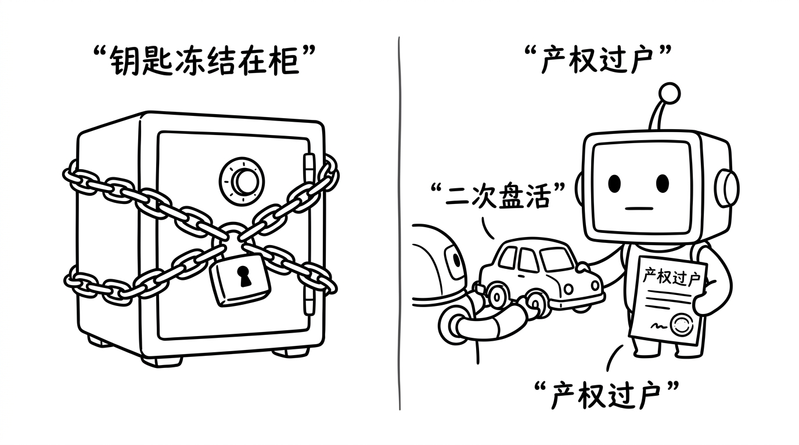
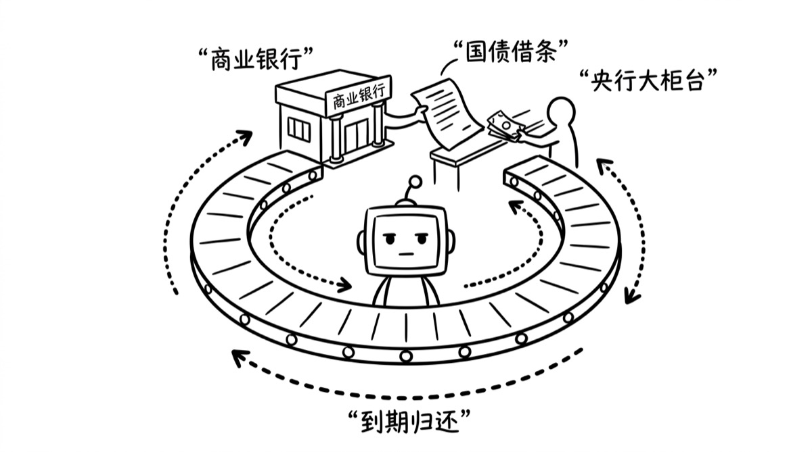
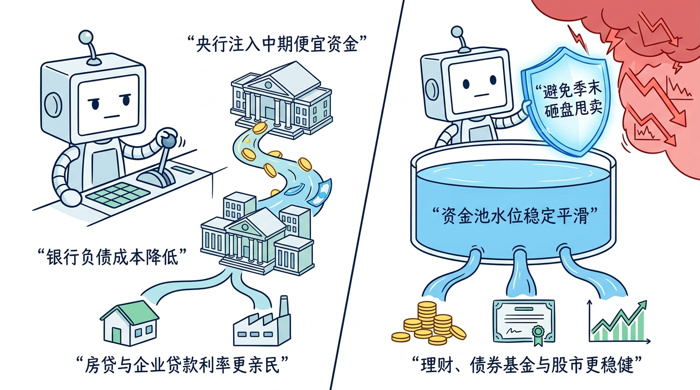
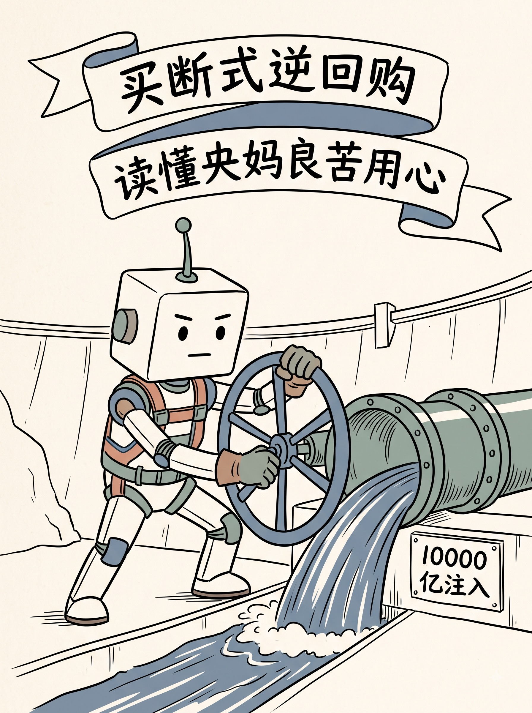
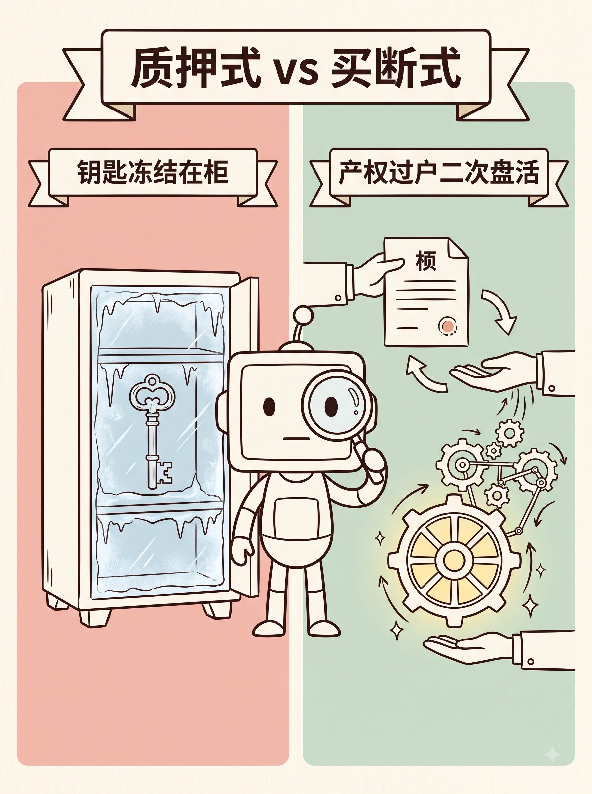
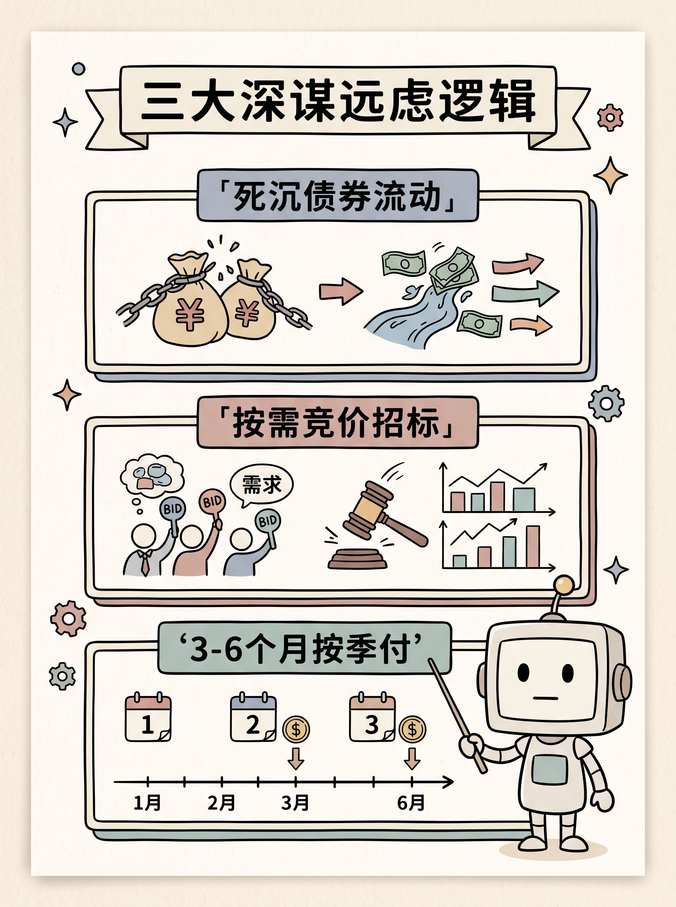
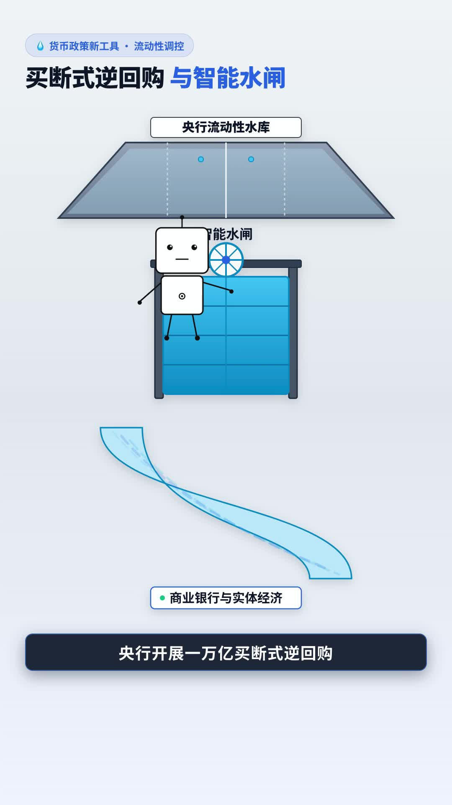

<div align="center">

# 🎨 AI Content Creator Studio & Skills Suite

### 面向高级创作者与总编辑的 AI 全流程内容工程化套件

[](LICENSE) [](#-底层纯粹原子技能库) [](#-双层架构设计) [](#-通用盲审引擎-blind-reviewer) [](#-审稿规则自进化机制-workflow-learn)

<p align="center">
  <b>包含端到端爆款长文写作、认知隐喻插图设计、微信公众号防擦除 HTML 排版、3:4 莫兰迪图文海报与自进化审稿系统</b>
</p>

[✨ 核心亮点](#-为什么选择-ai-creator-studio) • [🏛️ 架构设计](#-双层架构设计-dual-layer-architecture) • [🚀 快速上手](#-安装与使用指引) • [🖼️ 案例展示](#️-真实案例展示) • [🤖 业务工作流](#-端到端业务工作流-workflows)
[🧠 规则自进化](#-审稿规则自进化机制-workflow-learn) • [🛠️ 原子技能库](#-底层纯粹原子技能库) • [🎨 IP 角色体系](#-配图角色-ip-自定义指引) • [📁 目录结构](#-项目目录结构)

---

</div>

## 💡 为什么选择 AI Creator Studio？

> [!NOTE]
> 传统 AI 创作工具往往存在 **AI 味浓厚、格式挤压乱码、排版依赖微信后台被擦除、且“不长记性重复踩坑”** 等痛点。本套件通过 **双层解耦架构 + SubAgent 独立盲审 + 人工修改自进化闭环**，打造专业编辑级的内容产出工程。

* **⚡ 双层解耦架构设计**：底层原子技能 (`skills/`) 纯粹无状态、零依赖，可拆分单独安装；上层工作流 (`workflows/`) 串联检索、编排、盲审与人审卡点。
* **🔍 独立 SubAgent 盲审引擎 (`blind-reviewer`)**：打破“AI 既当作者又当裁判”的自夸误区，启动独立审稿子进程进行苛刻质检与诊断打回。
* **🧠 审稿规则自进化机制 (`/workflow-learn`)**：自动搜集最近一轮审核中的意见归纳，呈报带编号候选条目供主编选择，所选规则精准沉淀至项目规范，实现“精准关卡控制与规则自进化”。
* **🎨 离线美学排版系统**：提供微信公众号离线 HTML 防擦除视觉系统、以及防乱码的 3:4 莫兰迪手绘社媒海报套件。

---

## 🖼️ 真实案例展示

> 以下素材均由本套件全自动产出，主题：**《买断式逆回购？别慌！带你读懂央妈的良苦用心》**

### 🎨 正文认知隐喻配图（`/正文插图`）

6 张纯白背景、线稿手绘风格的认知隐喻图，原生中文标注，由 `illustration-designer` 技能全自动设计并批量生成：

<table>
  <tr>
    <td align="center"><br><sub>智能水闸门 · 调控流动性</sub></td>
    <td align="center"><br><sub>出借债券换取资金</sub></td>
    <td align="center"><br><sub>买断式 vs 质押式对比</sub></td>
  </tr>
  <tr>
    <td align="center"><br><sub>利率走廊机制</sub></td>
    <td align="center"><br><sub>流动性传导路径</sub></td>
    <td align="center"><br><sub>精准滴灌 vs 大水漫灌</sub></td>
  </tr>
</table>

---

### 🖼️ 手绘社媒海报（`/海报`）

4 张 3:4 竖版莫兰迪配色手绘海报，匹配经典版式，由 `poster-designer` 技能全自动配置，按需生图：

<table>
  <tr>
    <td align="center"><br><sub>封面海报 · 横幅版式</sub></td>
    <td align="center"><br><sub>核心概念 · 左右分栏</sub></td>
    <td align="center"><br><sub>流程拆解 · 三步骤</sub></td>
    <td align="center"><br><sub>收官总结 · 大字留白</sub></td>
  </tr>
</table>

---

### 🎬 动画讲解视频（`/讲解视频`）

由 7 个独立 HyperFrames 动画单元渲染、FFmpeg 极速拼接，同步交付横竖屏双比例成品，成品时长约 **1 分 20 秒**：

<table>
  <tr>
    <td align="center">
      <a href="https://mp.weixin.qq.com/s/R_0799YjXnVRabRGunO_8g" target="_blank" rel="noopener noreferrer">
        <br>
        <sub>▶ 16:9 横屏版（1920×1080）· 点击观看</sub>
      </a>
    </td>
    <td align="center">
      <a href="https://www.xiaohongshu.com/explore/6a80732a0000000028001f53?xsec_token=AB8amE5gqLpjDuJAVS9VbpXZGGJ-bSLeks2MWh-8eqoz8=&xsec_source=pc_user" target="_blank" rel="noopener noreferrer">
        <br>
        <sub>▶ 9:16 竖屏版（1080×1920）· 点击观看</sub>
      </a>
    </td>
  </tr>
  <tr>
    <td align="center"><sub>适用平台：B 站 / YouTube / 微信视频号 / PC</sub></td>
    <td align="center"><sub>适用平台：抖音 / 小红书 / Shorts / 竖屏移动端</sub></td>
  </tr>
</table>

---

## 🏛️ 双层架构设计 (Dual-Layer Architecture)

```text
┌──────────────────────────────────────────────────────────────────────────────────┐
│                         上层业务工作流 (Workflows Layer)                         │
│    workflows/article.md  │  illustrations.md  │  weixin.md  │  poster.md  │  video.md │
│    - 联网事实检索、文件夹自动创建、SubAgent 盲审调度、人工 Gate 确认卡点         │
└────────────────────────────────────────┬─────────────────────────────────────────┘
                                         │ 调度技能 & 传递上下文
                                         ▼
┌──────────────────────────────────────────────────────────────────────────────────┐
│                      底层纯粹原子技能 (Atomic Skills Layer)                      │
│    skills/hot-topics  │  article-writer  │  video-script-writer  │  video-renderer  │
│    - 零依赖单点能力，输入文本 -> 输出高品质文章 / 4轨剧本 / TTS音频 / 双比例视频  │
└──────────────────────────────────────────────────────────────────────────────────┘
```

| 架构层级 | 所在目录 | 核心定位 | 最佳使用场景 |
| :--- | :--- | :--- | :--- |
| **底层：纯粹原子技能** | `skills/` | 零依赖、纯粹的单点能力工具。只处理具体输入文本，生成高质量的内容或生图提示词。 | 可通过 `npx skills add` 独立安装到任意 Agent 运行环境中拆用。 |
| **上层：业务工作流** | `workflows/` | 多步骤场景编排。负责联网检索、建立主题目录、执行 AI 盲审与人工确认。 | 将工作流放入项目的 Agent 配置目录（如 `.agents/workflows/`）全自动运行。 |

---

## 🚀 安装与使用指引

### 0. 运行依赖 (Dependencies)

> [!NOTE]
> 本套件包含以下环境与工具依赖。在实际工作流运行中，**Agent 会根据需要全自动补全与安装所需依赖**，无需用户手动预先配置：
> * **Python 3.8+ & edge-tts**：驱动语音配音与字幕时间轴生成 (`voiceover-generator`)
> * **FFmpeg 4.0+**：驱动 Sidechain Audio Ducking 音频混流与视频单元拼接 (`video-renderer`)
> * **Node.js 22+ & HyperFrames Skills**：驱动矢量动画构建与视频单元片段渲染 (`video-storyboard-designer`)

---

### 1. 单独安装与拆用原子技能

如果您只需要在自己的 Agent 中单独使用某个写作或设计能力（例如仅需长文写作或海报设计）：

```bash
# 全量安装本仓库的所有原子技能
npx skills add morrain/ai-creator-skills

# 或仅安装指定的单个技能（例如：文章写作技能）
npx skills add morrain/ai-creator-skills --skill article-writer
```

> [!TIP]
> **对话调用示例**：
> - *"使用 `article-writer` 技能，帮我为主题 'Vue 3.5 响应式原理' 拟定一份大纲"*
> - *"使用 `illustration-designer` 技能，为 '探照灯聚焦夜空' 这个比喻设计 16:9 英文生图提示词"*

---

## 🤖 端到端业务工作流 (Workflows)

将本仓库的 `workflows/` 目录放入项目的 Agent 配置路径（如 `.agents/workflows/`）中，即可在对话框中直接通过命令触发：

| 触发命令 | 工作流文件 | 功能说明 | 交付产物 |
| :--- | :--- | :--- | :--- |
| **`/写文章 [主题]`** | [`workflows/article.md`](workflows/article.md) | 联网检索事实，拟定大纲待人工确认，生成呼吸感排版文章正文。 | `./<主题目录>/outline.md`<br>`./<主题目录>/<文章标题>.md` |
| **`/正文插图`** | [`workflows/illustrations.md`](workflows/illustrations.md) | 提取文章核心金句与概念，设计认知隐喻配图方案与英文 Prompt。 | `./<主题目录>/assets/illustration_*.md`<br>`./<主题目录>/images/illustration_*.png` (确认后生成) |
| **`/微信公众号`** | [`workflows/weixin.md`](workflows/weixin.md) | 排版为微信专用离线 HTML 网页，自动消解表格与注入防擦除 CSS。 | `./<主题目录>/mp_article.html` |
| **`/海报`** | [`workflows/poster.md`](workflows/poster.md) | 提取海报组图蓝图与版式，生成 3:4 生图配置与纯文本社媒文案。 | `./<主题目录>/assets/poster_*.md`<br>`./<主题目录>/poster_post.md`<br>`./<主题目录>/images/poster_*.png` (确认后生成) |
| **`/讲解视频`** | [`workflows/video.md`](workflows/video.md) | 提炼 4 轨剧本与 3 幕动态动作链，呈报剧本拆分方案经人工确认后落盘脚本，TTS 配音，派发 SubAgent 默认逐单元渲染 9:16 竖屏切片（可选 16:9 宽屏），FFmpeg 极速缝合成品。 | `./<主题目录>/assets/video/video_script.json`<br>`./<主题目录>/assets/video/unit_XX/BRIEF.md`<br>`./<主题目录>/video_9x16.mp4`<br>`./<主题目录>/video_16x9.mp4` (按需生成) |
| **`/workflow-learn [环节]`** | [`workflows/learn.md`](workflows/learn.md) | 搜集最近一轮审核意见归纳供用户选择，将所选规则沉淀至对应的审稿规则库。 | `./learnings/<phase>.md` (项目根目录) |

---

## 🛡️ 人机协同与防翻车机制

工作流内部设计了严格的防翻车机制与按需生成规则：

1. **大纲人工确认卡点**：
   - 执行 `/写文章` 时，完成联网检索和大纲审稿后，会自动存盘 `outline.md` 并**显式暂停对话**。
   - 必须等待你在对话框回复 `[通过]` 或提出修改意见后，才会继续撰写正文。
2. **提示词先行与按需生图**：
   - 执行 `/正文插图` 或 `/海报` 时，**默认只生成提示词配置文件**（`assets/*.md`），不直接消耗算力 / API 配额。
   - 当你预览配置文件满意后，回复 **“开始生图”** 显式指令，系统才会批量渲染图片。
3. **审稿规则自进化与反哺**：
   - 每次产物生成或审核后，在对话框回复 **`/workflow-learn`**。
   - 系统会自动搜集最近一轮审核中的意见归纳，呈报带编号候选清单供你选择，仅将你选中的偏好沉淀落盘至 `./learnings/<phase_id>.md`，实现精准规则进击！

---

## 🧠 审稿规则自进化机制 (`/workflow-learn`)

为了解决 AI 创作中“重复踩坑”、“不长记性”的痛点，套件内置了**分环节审稿规则自进化机制**，实现“主编审查一次，AI 盲审精准记住”的品质进化闭环：

```text
┌──────────────────────────────────────────────────────────────────────────────────┐
│  1. 盲审质检阶段 (SubAgent 盲审)                                                 │
│  - 工作流在各个关键节点自动启动 `blind-reviewer` 进行冷酷苛刻质检                │
│  - 自动装载【技能默认基线】+【项目专属进化规则 (`./learnings/<phase_id>.md`)】   │
└────────────────────────────────────────┬─────────────────────────────────────────┘
                                         │ 生成初始产物 / 呈现给主编审阅
                                         ▼
┌──────────────────────────────────────────────────────────────────────────────────┐
│  2. 主编人工精修与反馈 (Human Review)                                            │
│  - 主编对生成的产物（大纲、正文、插图提示词、微信HTML、海报文案）进行修改批注    │
└────────────────────────────────────────┬─────────────────────────────────────────┘
                                         │ 在对话框中回复 /workflow-learn
                                         ▼
┌──────────────────────────────────────────────────────────────────────────────────┐
│  3. 意见归纳与交互选择 (Recent Feedback & User Selection)                       │
│  - 系统自动搜集最近一轮审核中的意见归纳，呈报带编号的规则候选清单                 │
│  - 由主编回复编号勾选需要沉淀的条目，所选规则增量落盘至 `./learnings/<phase_id>.md`│
│  - 以后每次盲审该环节时，SubAgent 自动吸收主编选中的新偏好，实现精准自进化！     │
└──────────────────────────────────────────────────────────────────────────────────┘
```

### ⚙️ 分环节确定性路由表 (`phase_id`)

| 环节标识 (`phase_id`) | 覆盖的创作环节 | 审查资产文件 | 对应的项目进化规则路径 (项目根目录) |
| :--- | :--- | :--- | :--- |
| **`article_outline`** | 文章大纲阶段 | `./<slug>/outline.md` | `./learnings/article_outline.md` |
| **`article_content`** | 文章正文阶段 | `./<slug>/<slug>.md` | `./learnings/article_content.md` |
| **`illustrations`** | 正文插图阶段 | `./<slug>/assets/illustration_*.md` | `./learnings/illustrations.md` |
| **`weixin`** | 微信公众号排版 | `./<slug>/mp_article.html` | `./learnings/weixin.md` |
| **`poster_blueprint`** | 海报故事线蓝图 | 海报章节与版式拆分方案 | `./learnings/poster_blueprint.md` |
| **`poster_config`** | 单张海报 Prompt | `./<slug>/assets/poster_*.md` | `./learnings/poster_config.md` |
| **`poster_post`** | 海报社媒文案 | `./<slug>/poster_post.md` | `./learnings/poster_post.md` |
| **`video_script`** | 讲解剧本阶段 | `./<slug>/assets/video/video_script.json` | `./learnings/video_script.md` |
| **`video_storyboard`** | 视频单元分镜契约阶段 | `./<slug>/assets/video/unit_XX/BRIEF.md` | `./learnings/video_storyboard.md` |
| **`video_unit`** | 视频单元渲染阶段 | `./<slug>/assets/video/unit_XX/BRIEF.md` | `./learnings/video_unit.md` |
| **`<new_phase_id>`** | (未来扩展新环节) | (新场景产物) | `./learnings/<new_phase_id>.md` |

---

## 🛠️ 底层纯粹原子技能库

| 技能 ID | 技能定义说明 (`SKILL.md`) | 核心功能特性 |
| :--- | :--- | :--- |
| **`hot-topics`** | [`skills/hot-topics/SKILL.md`](skills/hot-topics/SKILL.md) | 自动抓取全网热榜 (今日热榜 https://tophub.today/)，去重聚合热点并提供科普创作切入建议。 |
| **`article-writer`** | [`skills/article-writer/SKILL.md`](skills/article-writer/SKILL.md) | 长文与大纲写作，支持干货指南、科技深度评论、社会观察、科普解说、故事叙事 5 种文风自适应识别。 |
| **`illustration-designer`** | [`skills/illustration-designer/SKILL.md`](skills/illustration-designer/SKILL.md) | 单图视觉隐喻设计，提炼认知概念与低科技物件，设计 16:9 纯白背景与原生中文批注提示词。 |
| **`wx-formatter`** | [`skills/wx-formatter/SKILL.md`](skills/wx-formatter/SKILL.md) | 微信公众号离线排版，套用防擦除视觉样式系统，自动消解表格为双色卡片，输出带视口的原生 HTML。 |
| **`poster-designer`** | [`skills/poster-designer/SKILL.md`](skills/poster-designer/SKILL.md) | 手绘图文海报设计，匹配 10 大经典版式与莫兰迪配色，输出防乱码的 3:4 生图配置与极简社媒文案。 |
| **`blind-reviewer`** | [`skills/blind-reviewer/SKILL.md`](skills/blind-reviewer/SKILL.md) | **通用自进化盲审引擎**，接收审查资产与规则路径，执行苛刻质检并输出二元裁决报告。 |
| **`video-script-writer`** | [`skills/video-script-writer/SKILL.md`](skills/video-script-writer/SKILL.md) | 4 轨讲解剧本提炼，生成包含时间轴、口播文案、视觉描述与屏幕花字的 4 轨 `video_script.json`。 |
| **`voiceover-generator`** | [`skills/voiceover-generator/SKILL.md`](skills/voiceover-generator/SKILL.md) | TTS 极速配音与字幕生成，默认使用免 Key Edge-TTS 导出口播 MP3、SRT 字幕与 `audio_meta.json` 时间轴。 |
| **`video-storyboard-designer`** | [`skills/video-storyboard-designer/SKILL.md`](skills/video-storyboard-designer/SKILL.md) | 视频单元需求构建，推演 3 幕动态动作链 (Hook ➔ Action ➔ Delivery) 并输出 HyperFrames `BRIEF.md` 契约。 |
| **`video-renderer`** | [`skills/video-renderer/SKILL.md`](skills/video-renderer/SKILL.md) | 视频无损拼接与混流，使用 FFmpeg 快速拼合视频单元片段，混入配音与 BGM 并应用 Sidechain Audio Ducking。 |

---

## 🎨 配图角色 IP 自定义指引

技能套件默认使用 **“小智”**（方块头、单天线、点点眼小机器人）作为配图与海报的主角形象。如果你希望使用自定义的角色 IP：

> [!IMPORTANT]
> **IP Mascot 校验优先级（统一文件名为 `character_ip.md`，只要找到一份即生效）**：
> 1. **主题目录级**：在具体的文章目录下新建 `./<主题目录>/character_ip.md`。
> 2. **项目根目录级（推荐）**：在项目根目录下新建 `./character_ip.md`。
> 3. **默认回退**：读取技能内置的默认 IP（小智）。

---

## 📁 项目目录结构

```text
ai-creator-skills/
├── GEMINI.md                               # 项目 Agent 规则与配置
├── LICENSE                                 # MIT 开源协议许可文件
├── README.md                               # 本文档
├── character_ip.md                         # (可选) 项目级自定义 IP 规范模板 (小智 Mascot 预置)
├── showcase/                               # 真实案例素材（认知隐喻配图 & 莫兰迪海报展示）
├── learnings/                              # (动态按需生成) 首次人审运行 /workflow-learn 后自动创建的分环节自进化审稿规则库
│   ├── article_outline.md                  # 文章大纲自进化规则
│   ├── article_content.md                  # 文章正文自进化规则
│   ├── illustrations.md                    # 正文插图自进化规则
│   ├── weixin.md                           # 微信排版自进化规则
│   ├── poster_blueprint.md                 # 海报蓝图自进化规则
│   ├── poster_config.md                    # 单张海报 Prompt 自进化规则
│   ├── poster_post.md                      # 海报社媒文案自进化规则
│   ├── video_script.md                     # 讲解剧本自进化规则
│   ├── video_storyboard.md                 # 视频单元分镜契约自进化规则
│   └── video_unit.md                       # 视频单元渲染自进化规则
├── docs/                                   # 项目设计文档与 ADR 决策记录
│   ├── adr/                                # 架构决策记录目录
│   │   ├── 0001-per-scene-hyperframes-ffmpeg-pipeline.md # 独立视频单元与 HyperFrames 拼接架构 ADR
│   │   └── 0002-multi-aspect-ratio-video-pipeline.md     # 双比例视频渲染管道架构 ADR
│   ├── spec-multi-aspect-ratio-rendering.md              # 多比例渐进式视频渲染功能规格
│   └── agents/
├── skills/                                 # 底层纯粹原子技能 (可单独安装)
│   ├── hot-topics/                         # 1. 热门话题抓取
│   ├── article-writer/                     # 2. 文章与大纲写作
│   ├── illustration-designer/              # 3. 单图视觉隐喻设计
│   ├── wx-formatter/                       # 4. 微信公众号排版
│   ├── poster-designer/                    # 5. 手绘海报设计
│   ├── blind-reviewer/                     # 6. 通用自进化盲审引擎
│   ├── video-script-writer/                # 7. 4 轨讲解剧本提炼
│   ├── voiceover-generator/                # 8. TTS 配音与字幕轴提取
│   ├── video-storyboard-designer/          # 9. 视频单元 3 幕动作链与 HyperFrames BRIEF 契约
│   └── video-renderer/                     # 10. FFmpeg 视频拼接与 Sidechain Audio Ducking 混流
├── workflows/                              # 上层业务工作流 (自动化编排与审查)
│   ├── article.md                          # 写文章工作流 (/写文章)
│   ├── illustrations.md                    # 正文插图工作流 (/正文插图)
│   ├── weixin.md                           # 微信公众号排版工作流 (/微信公众号)
│   ├── poster.md                           # 图文海报工作流 (/海报)
│   ├── video.md                            # 讲解视频工作流 (/讲解视频)
│   └── learn.md                            # 规则自进化反哺工作流 (/workflow-learn)
└── <topic-slug>/                           # 实例：主题文件目录 (拟定大纲时自动新建)
    ├── outline.md                          # 文章大纲
    ├── <topic-slug>.md                     # 文章正文
    ├── character_ip.md                     # (可选) 主题级自定义 IP 规范
    ├── mp_article.html                     # 微信公众号离线网页
    ├── poster_post.md                      # 社媒纯文本文案
    ├── assets/                             # 生图提示词配置文件与视频资产
    │   ├── illustration_1.md               # 插图 1 配置文件
    │   ├── poster_1.md                     # 海报 1 配置文件
    │   ├── poster_2.md                     # 海报 2 配置文件
    │   └── video/                          # 讲解视频工作区
    │       ├── video_script.json           # 4 轨讲解剧本定稿
    │       ├── audio/                      # TTS 配音与字幕时间轴
    │       │   ├── voiceover.mp3
    │       │   ├── unit_XX.mp3             # 各单元独立配音切片
    │       │   └── timestamps.json
    │       ├── unit_01/                    # 视频单元 01 (独立 HyperFrames 项目)
    │       │   ├── BRIEF.md                # 当前活跃分镜契约 (供 HyperFrames SubAgent 消费)
    │       │   ├── BRIEF_16x9.md           # 16:9 宽屏分镜契约快照
    │       │   ├── BRIEF_9x16.md           # 9:16 竖屏分镜契约快照
    │       │   ├── index.html              # 当前活跃动画源码
    │       │   ├── index_16x9.html         # 16:9 宽屏动画源码快照
    │       │   ├── index_9x16.html         # 9:16 竖屏动画源码快照
    │       │   ├── unit_01_16x9.mp4        # 16:9 宽屏渲染归档片段
    │       │   ├── unit_01_9x16.mp4        # 9:16 竖屏渲染归档片段
    │       │   └── public/mascot.svg       # 矢量 IP 资产
    │       └── unit_02/ ...               # 视频单元 02~N (结构同上)
    ├── images/                             # 图片渲染产物目录 (按需生成)
    │   ├── illustration_1.png ~ illustration_N.png
    │   └── poster_1.png ~ poster_N.png
    ├── video_16x9.mp4                      # 横屏宽屏成品视频 (FFmpeg 拼接导出)
    └── video_9x16.mp4                      # 竖屏移动成品视频 (FFmpeg 拼接导出)
```

---

## 📄 开源协议 (License)

本项目基于 [MIT License](LICENSE) 开源协议发布，您可以自由进行复制、修改、分发及商业化使用。详见 [LICENSE](LICENSE) 文件。

---

<div align="center">

**Made with ❤️ for AI Content Creators & Editors**

</div>